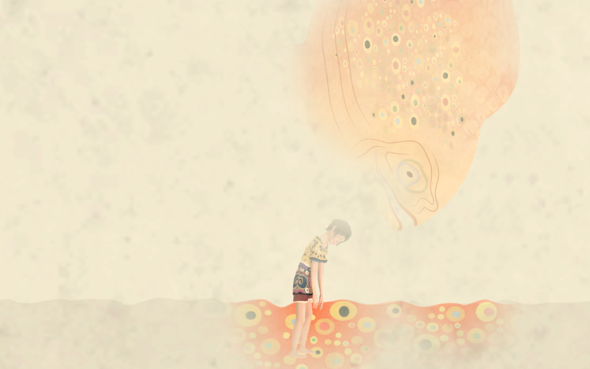
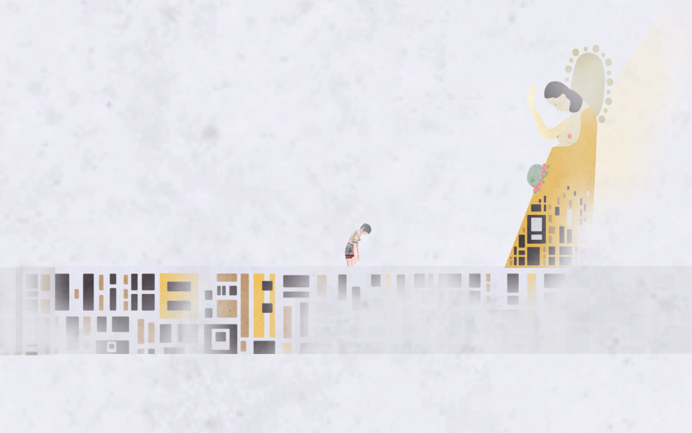

# rem - an exploration game about REM sleep and dream waves

The game was created during the 2017 Global Game Jam (Topic "Waves") in Karlsruhe, Germany hosted by the [GameLab Karlsruhe](http://postdigital.hfg-karlsruhe.de/gamelab/)
For further information on the GGJ17 visit http://globalgamejam.org/2017/games/rem.

## Idea

The point of relief and restore while we sleep begins when we enter the REM phase.
To get there we have to pass three Non-REM phases first.
Our brain waves differ at each stage of sleep.
During the deepest phase these waves nearly vanish, with only 0,5 Hz.
But the demons we fought at daylight haunt us at nighttime and even prevent us from entering the relief zone.
Once trapped, they force us to redream the same haunting and stressing scenario, which we experienced at daytime, again and again.
But now in a scattered dream realm our mind created no doubt that this is reality.

## Gameplay

You guide Rem through the different stages of sleep to the final and relaxing REM phase.
It's a game about a dreamworld with the art style of [Gustav Klimt](https://en.wikipedia.org/wiki/Gustav_klimt).
You experience the beauty a dream can offer.
At the same time you have to face the weird cruelties our subconsciousness is capable to create.
With the Tobii eye tracking software (or a mouse as a substitute) you interact and navigate through this dream and need to overcome your nightmares. 

## Screenshots

Gustav Klimt - Hope II, 1907–08, Museum of Modern Art, New York City

## License

All pictures, models, audio tracks and audio effect where created by the team.
Please ask before using them in your own projects.

## final thoughts

Artzi!

[waves of pain!!!](http://globalgamejam.org/2017/games/waves-pain)
